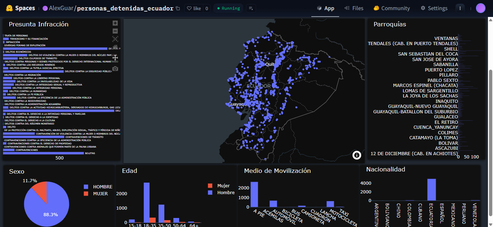

#  Personas\_Detenidas\_Ecuador

#  Description

This dashboard allows us to know the behaviour of a person in Ecuador that was detained at different points in Ecuador. 

You can get information specifying where it was detained.

# Usage

The dash can use throw two ways:

1. Clone the directory.

2 To visit the page [Click to use the project](https://huggingface.co/spaces/AlexGuar/personas\_detenidas\_ecuador)

In this example, I use the option Lasso that allows selecting points.

# License

MIT License

